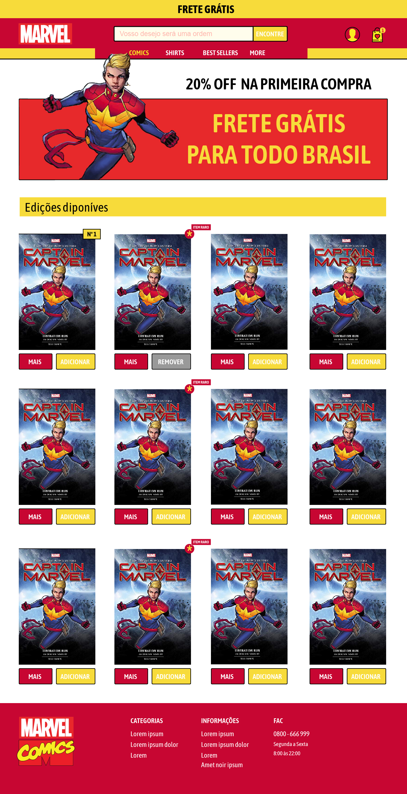
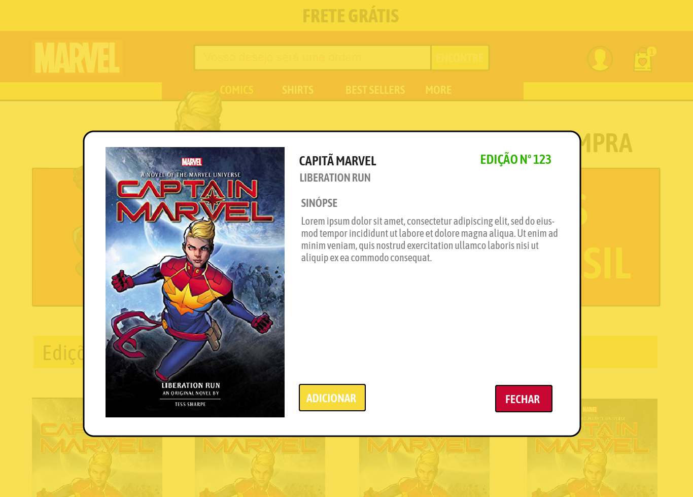
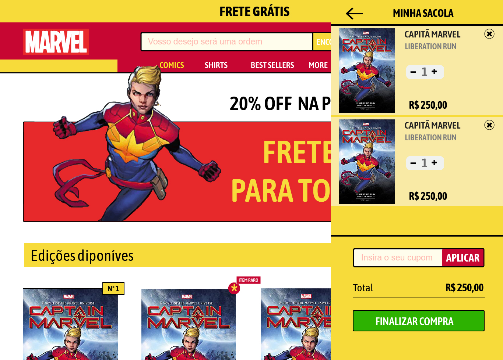

# :scroll: Desafio Liberfly
<h1 align="center">
   Design
</h1>
<h1 align="center">
   
</h1>

<h1 align="center">
   
</h1>

<h1 align="center">
   
</h1>

<h2 >
  🖥️ Tecnologias aplicadas no projeto
</h2>

&rarr; <a href="https://vuejs.org/">Vue</a>  
&rarr; <a href="https://www.npmjs.com/package/vue-axios">Axios</a>  
&rarr; <a href="https://picturepan2.github.io/spectre/">Spectre.css</a>  

------------

<h2 >
  🖥️ Passos concluídos
</h2>

- [x] Lista de quadrinhos consumindo a api da Marvel
- [x] Modal de detalhe do quadrinho selecionado
- [x] Tela de checkout
- [ ] Validação de cupom de desconto
- [x] Lista de quadrinhos adicionados ao carrinho
- [ ] Exibir a quantidade de quadrinhos selecionados no cart
- [ ] Carregamento aleatório de quadrinhos raros
